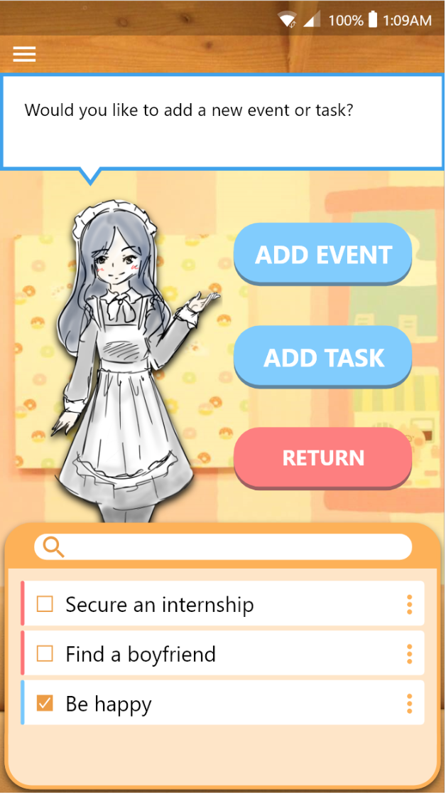

# BAEBot Calendar

 

## Introduction
BAEBot makes it easier to manage tasks because it has all the necessary functionalities to organize a calendar and in addition, it can automate some re-scheduling activities. A user can add, edit or delete a task in BAEBot effortlessly and view the corresponding task details with a single tap. Should a user choose to postpone a task for some reason, or a task becomes overdue, BAEBot will take care of this by searching for other availabilities in the calendar and automatically rescheduling this task. In this process, BAEBot will act smart and try to avoid scheduling the task at a similar time, so as to minimize the possibility of postponing that task again. With the basic calendar functionalities and the additional automatic scheduling for overdue tasks, BAEBot will make it easier to organize daily schedules.

BAEBot allows a user to have a complete overview of their events in a monthly calendar view. BAEBot synchronizes the calendar content with the phone calendar, making it convenient for a user to check the events that are already saved. A user can easily add new events to their calendar as they need. They can also view the description of their events in BAEBot to check out event details. BAEBot is fully committed to serving a user with necessary reminders, so as to allow a user to enjoy a more organized life.

BAEBot allows a user to feel more motivated with our daily personal encouragement and become more healthy with our sleep time suggestion and a daily motivational quote that energizes them at the beginning of each day. These positive vibes will encourage a user to live their life to the fullest. Using BAEBot promotes a user to have a more healthy lifestyle and enjoy a fulfilling life.

BAEBot is catered for a wide range of users to provide quality assistance in scheduling tasks, automatically keeping track of pending tasks and upcoming events, as well as living a positive, healthy life. With the aid of BAEBot, the life of users would be surely more organized and rewarding!

## Technolgy Used:
1. Firebase
2. Java / Android Studio
3. Google APIs

## Apps Feature:
1. Integration with Google Calendar
2. One-click reschedule unfinished tasks
3. Weathers based on user location
4. Kids-friendly UI

## Acknowledgement
This project is made by SPONGE team for CSE110 at UCSD.
